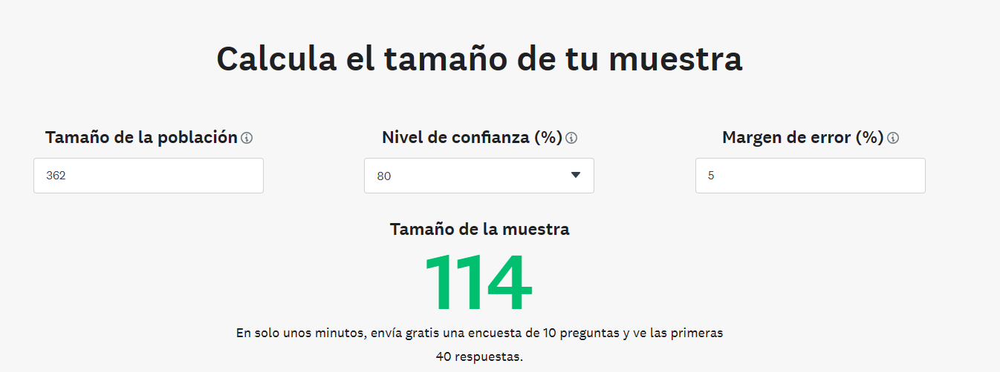

# Motor de busqueda usando indexación
- Juan Páez
- Anderson Alvarado
## Obteniendo palabras que no son relevantes para el índice
Para obtener esta lista de palabras se realizó un muestreo de los cursos, con el fin de 
obtener la información de estos, y saber cuáles son las palabras que no son relevantes 
para el índice.

Utilizando una calculadora online para obtener el tamaño de la muestra,
nos da este resultado:

Por lo tanto se ejecutó el código obteniendo **114** cursos con su respectiva información.

```python
def most_frecuent_words(words):
```
Esta función que se encuentra en utils.py en la clase UtilText, cumple la
función de generar un diccionario de palabras con su respectiva frecuencia.
Y a partir del resultado, se realizará un análisis de que palabras deberían omitirse
en la creación del índice.

A continuación, se presenta, parcialmente, el resultado al ejecutar la obtención
de estas palabras:
```json
{
  "aplica": 1756,
  "para": 1222,
  "como": 582,
  "universidad": 499,
  "salud": 389,
  "objetivos": 345,
  "curso": 282,
  "desarrollo": 267,
  "javeriana": 263,
  "seguridad": 253,
  "pontificia": 233,
  "herramientas": 229,
  "sobre": 209,
  "este": 207,
  "programa": 197,
  "trabajo": 191,
  "aprendizaje": 187,
  "unidad": 184,
  "proyectos": 183,
  "digital": 179,
  //...
}
```
A criterio de los autores de este taller, las palabras que se
repiten desde 100 veces en adelante, no genera valor al 
indexador a construir. Por lo tanto, seran omitidas.
## Crawler.py

Este archivo de Python contiene una clase llamada `Crawler` que se utiliza para realizar web scraping en un sitio web de cursos. La clase tiene métodos para obtener los enlaces de los cursos y las palabras de los cursos.

El método `get_links` se utiliza para obtener los enlaces de los cursos a partir de una URL inicial y un número específico de cursos a obtener. Utiliza la biblioteca BeautifulSoup para analizar el HTML de la página y extraer los enlaces de los cursos, y SeleniumWebDriver 
para obtener la pagina con la información de los cursos, teniendo en cuenta que esta carga los cursos de manera dinamica.

El método go es la función principal que inicia el proceso de web scraping. Utiliza el método get_links para obtener los enlaces de los cursos y luego recorre cada curso para extraer las palabras relevantes. Utiliza la clase UtilText para obtener las palabras útiles, por medio de expresiones regex y validación de cantidad de caracteres, y eliminar las palabras inútiles las cuales se obtuvieron a partir del proceso anteriormente descrito guardadas en el json `frequences.json`. Luego, guarda los id de los cursos como llave y los enlaces de estos como valor, guardandolo en un archivo JSON y las palabras de los cursos en un archivo CSV.
## Search.py
La función `find_similar_courses` busca los cursos más similares a una lista de palabras proporcionadas. La similitud se calcula utilizando la métrica de similitud de Jaccard.
### Detalles de implementación

La función primero convierte la lista de palabras en un conjunto para facilitar la comparación. Luego, agrupa el DataFrame por 'course_id' y combina todas las palabras para cada curso en un conjunto. Después, calcula la similitud de Jaccard entre el conjunto de palabras y el conjunto de palabras de cada curso. Finalmente, ordena los cursos por su similitud y devuelve los IDs de los cursos más similares.

La función `search` recibe un Dataframe. Luego, utiliza la función `find_similar_courses` para encontrar los cursos más similares a las palabras proporcionadas. Finalmente, devuelve los URLs de los cursos más similares.

## Compare.py

La función `find_similar_two_courses` busca los cursos más similares a una lista de palabras proporcionadas. La similitud se calcula utilizando la métrica de similitud de Jaccard.

La función `compare` recibe un Dataframe y luego, agrupa el DataFrame por 'course_id' y combina todas las palabras para cada curso en un conjunto. Finalmente, utiliza la función `find_similar_two_courses` para obtener un indicador de similaridad a partir de la métrica especificada.

## Ejemplo de uso
```console
Enter the number of courses to search: 20
Enter the name of the JSON file (without extension): courses
Enter the name of the CSV file (without extension): index
Enter the keywords separated by commas (,): doctrina,lesbiana,caldas,especificos,aportes
The 5 most relevant courses are:
*   https://educacionvirtual.javeriana.edu.co/aproximacion-a-los-temas-de-envejecimiento-y-vejez
*   https://educacionvirtual.javeriana.edu.co/atencion-integral
*   https://educacionvirtual.javeriana.edu.co/temporomandibulares
*   https://educacionvirtual.javeriana.edu.co/reposteria-j-colombia
*   https://educacionvirtual.javeriana.edu.co/produccion-campesina-familiar
Enter the ID of the first course to compare: gerencia-enfermeria
Enter the ID of the second course to compare: temporomandibulares
The similarity between gerencia-enfermeria and temporomandibulares is 0.04219409282700422
```